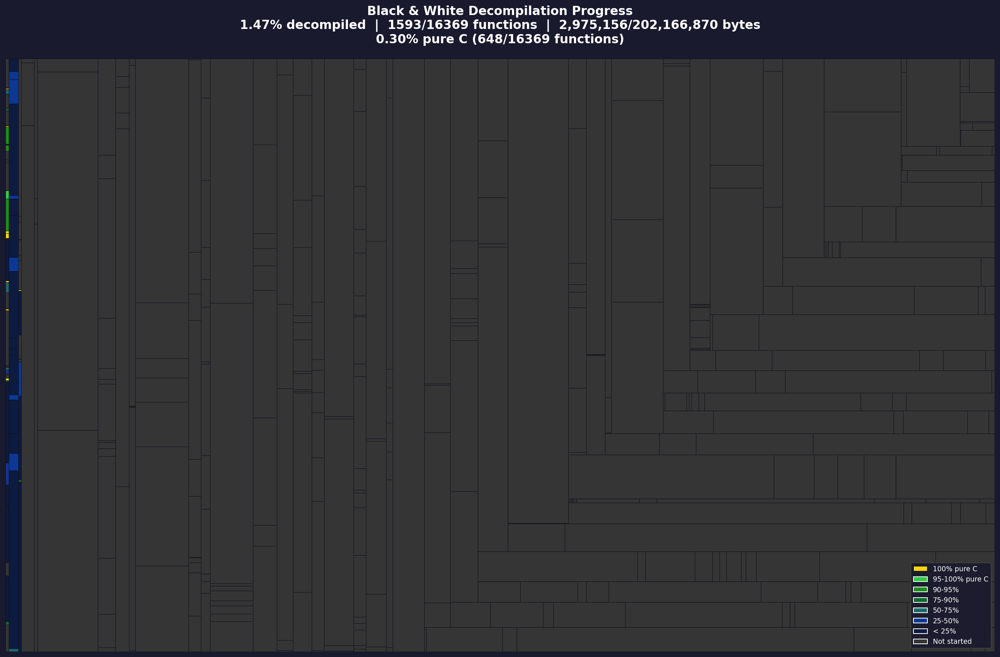

Black & White
[![Build Status]][actions] [![Progress]][progress site] [![DOL Progress]][progress site] [![RELs Progress]][progress site] [![Discord Badge]][discord]
=============

[Build Status]: https://github.com/openblack/bw1-decomp/actions/workflows/reassemble.yml/badge.svg
[actions]: https://github.com/openblack/bw1-decomp/actions/workflows/reassemble.yml
[Progress]: https://decomp.dev/openblack/bw1-decomp.svg?mode=shield&measure=code&label=Code&category=all
[DOL Progress]: https://decomp.dev/openblack/bw1-decomp.svg?mode=shield&measure=code&label=DOL&category=dol
[RELs Progress]: https://decomp.dev/openblack/bw1-decomp.svg?mode=shield&measure=code&label=RELs&category=modules
[progress site]: https://decomp.dev/openblack/bw1-decomp
[Discord Badge]: https://img.shields.io/discord/608729286513262622?logo=discord&logoColor=white
[discord]: https://discord.gg/5QTexBU

A byte-exact decompilation of Lionhead's Black & White (2001), targeting `runblack.exe` v1.20.

The goal is to rewrite every function in C so that the compiled output is identical to the original MSVC 6.0 binary, byte for byte. The build produces an executable with the same MD5 hash as the original.



* [Reverse Engineering Wiki](https://github.com/openblack/bw1-decomp/wiki)
* [Black & White Patches](https://github.com/openblack/bw1-patches/tree/master/patches)

## Custom LLVM toolchain

The original game was compiled with MSVC 6.0, which generates different instruction encodings than modern compilers. We maintain a [custom LLVM fork](https://github.com/jaidaken/llvm-project/tree/bw1-decomp) with per-function attributes that make Clang's output match MSVC 6.0's byte patterns.

The fork adds 14 encoding passes (e.g. `expand_movzx`, `prefer_xor8`, `trailing_bytes`) and 2 frame lowering attributes (`no_callee_saves`, `forced_callee_saves`) that control prologue/epilogue generation. See the [LLVM fork README](https://github.com/jaidaken/llvm-project/tree/bw1-decomp#readme) for the full attribute reference.

CMake downloads the pre-built LLVM automatically at configure time. To use a local build instead, set `-DLLVM_BINARIES_DIR=/path/to/bin`.

## Dependencies

### Linux

```bash
sudo apt install cmake ninja-build mingw-w64 libc6-dev-i386-cross python3
python3 -m venv .venv && source .venv/bin/activate
pip install -r scripts/source_code/requirements.txt
```

### macOS

```bash
brew install cmake ninja mingw-w64 python3
python3 -m venv .venv && source .venv/bin/activate
pip install -r scripts/source_code/requirements.txt
```

### Windows

Install [CMake](https://cmake.org/), [Ninja](https://ninja-build.org/), and Python 3, then:

```bash
python -m venv .venv && .venv\Scripts\activate
pip install -r scripts/source_code/requirements.txt
```

## Building

```bash
# Byte-exact reimplementation
cmake --workflow --preset release

# With debug symbols (for Ghidra, IDA Pro, live debugging)
cmake --workflow --preset relwithdebinfo
```

Building the `release` preset prints an md5 checksum to confirm the result is byte-for-byte identical:

| md5sum                             | version         |
| ---------------------------------- | --------------- |
| `174b1a64e74b2321f3c38ccc8a511e78` | 1.20 with no cd |

## Diffing with objdiff

[objdiff](https://github.com/encounter/objdiff) lets you compare decompiled functions against the original object files interactively.

```bash
# Generate the objdiff build and config
python configure_objdiff.py

# Then open objdiff pointed at the build directory
objdiff --project-dir cmake-build-presets/objdiff
```

## Source

The `src/` directory contains the decompilation source:

- `src/asm/` — assembly source for functions not yet decompiled to C/C++
  - `src/asm/unprocessed/` — raw unprocessed assembly; files named `runblack.reassemble.*` are the main `.text` sections
- `src/staging/` — C/C++ stubs used as the "base" side in objdiff comparisons

Data section files:
- `rdata.asm` — read-only data (function pointers, vtables)
- `data.asm` — read-write data (function pointers, RTTI structs)
- `data1.asm` — read-write data (likely from static linking)
- `SELFMOD.asm` — executable section (possibly SafeDisc related)
- `rsrc.asm` — resource data (icons etc.), built with cvtres from VS97

## Debug Symbols

The `relwithdebinfo` preset produces a PDB with globals, function definitions, and struct definitions usable in Ghidra and IDA Pro. Pre-built artifacts are available on the [Actions](https://github.com/openblack/bw1-decomp/actions/workflows/reassemble.yml) page.

For live debugging, build with `relwithdebinfo` and launch with the working directory set to the original game files directory (where `runblack.exe` lives).

## Contributing

1. Pick a function from `src/asm/` and decompile it to C/C++
2. Use objdiff (see above) to verify your output matches the original object code
3. Open a pull request — the CI will confirm the md5 still matches
